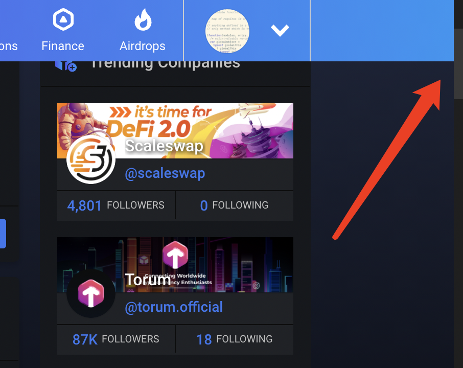
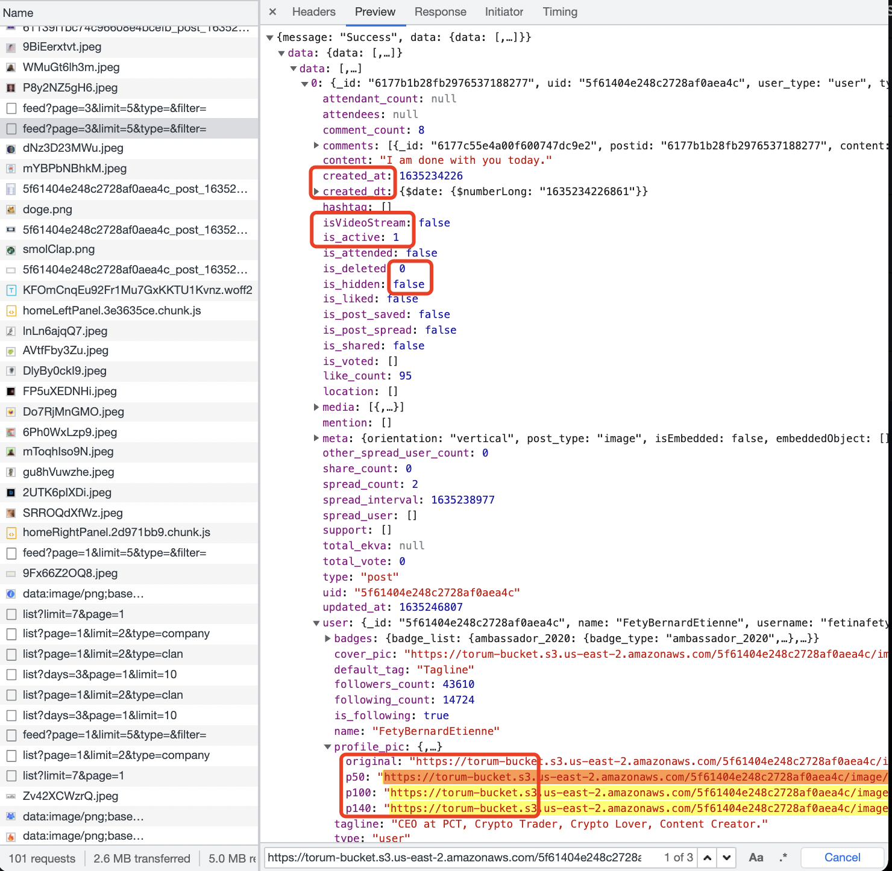

# crypto-journey

Crypto world from a full-stack developer's prospective

## tutorials

- [Solidity, Blockchain, and Smart Contract Course – Beginner to Expert Python Tutorial](https://www.youtube.com/watch?v=M576WGiDBdQ)
- [GUN Decentralized Graph DB in 100 Seconds](https://www.youtube.com/watch?v=oTQXzhm8w_8)
- [I built a decentralized chat dapp // GUN web3 Tutorial](https://www.youtube.com/watch?v=J5x3OMXjgMc)
- [figment](https://learn.figment.io/)
- [alchemy](https://www.alchemy.com)
- [Rust for beginners - Microsoft](https://www.youtube.com/playlist?list=PLlrxD0HtieHjbTjrchBwOVks_sr8EVW1x)
- [solana-nfts](https://buildspace.so/solana-nfts)
- [Blockchain Tutorial for Beginners | Build a DeFi App (Ethereum, Solidity, Web3.js & Truffle)](https://www.youtube.com/watch?v=CgXQC4dbGUE)

## talks

- [Gun feat. Mark Nadal - An open source cybersecurity protocol for syncing decentralized graph data](https://www.youtube.com/watch?v=_eo_7BxTrmc)

## frameworks

- [gun.js](https://gun.eco/)

  Great docs. Backed by Mozilla. 创始人技术背景，非常 charming and humble，在访谈中说如果开发者在使用 gun.js 过程中有任何问题想了 5 分钟还搞不定就是自己的责任。并且在 console 中留下了联系方式。

  Projects using gun.js:

  - [Iris](https://iris.to/) a P2P alternatives to Instagram made by Bitcoin's second ever developer, Martti Malmi!
  - [notabug](http://notabug.io/) Reddit clone
  - [mask](https://mask.io/) Encrypt your posts & chats on social networks Allow only your friends to decrypt.
  - [Meething](https://meething.space/) decentralized video chat funded by Mozilla

## [Octopus Network](https://oct.network/)

The Octopus Network is designed to serve appchains by providing flexible and affordable leased security, powerful out-of-box interoperability, and many useful infrastructures.

To put it simply, Octopus appchains pay rent in their native tokens to lease security from Octopus token holders.

Octopus Relay 是一组运行在 Near 上的智能合约。 项目方通过提供自己的代币，向 Octopus Relay 租用安全性。

PoS 安全性来源于质押，跨链的质押无法保证安全性。例如 A 链的质押总额为 1，导入的 B 链资产总额>1，那么 A 链的 validator 存在作恶的可能。Octopus 选择[Leased Proof-of-Stake](https://docs.oct.network/general/octopus-staking.html)方案，统一质押 OCT 使得作恶无利可图。项目方可以选择提供多少自己的 token 奖励给 validator，以达到满意的安全性。validator 自行选择为这个项目质押多少 OCT。在这种模型下，validator 的角色更像是项目投资者，而非简单的 IT 承包商。

- [documentation](https://docs.oct.network/)
- [discord](https://discord.gg/6GTJBkZA9Q) 不活跃，提问 3 天没有人回应。[link](https://discord.com/channels/820671513594167336/820671513594167339/901079934741663744)
- [Test Net](https://github.com/octopus-network/octopus-pallets/tree/main/appchain) 官网的地址指向的原 repo 已经 archived
- [Substrate](https://www.parity.io/technologies/substrate/)
  - [tutorial](https://docs.substrate.io/tutorials/v3/create-your-first-substrate-chain/)
  - [bilibili](https://space.bilibili.com/67358318/channel/detail?cid=106401)
- [INTER‑BLOCKCHAIN COMMUNICATION PROTOCOL](https://ibcprotocol.org/)
- [Near](https://near.org/)
- [Rainbow Bridge](https://near.org/blog/the-rainbow-bridge-is-live/)
- [Polkadot](https://polkadot.network/)
- [Kusama](https://kusama.network/)
- [Cosmos](https://cosmos.network/)
- [Starport](https://github.com/tendermint/starport)
- [Polygon](https://polygon.technology/)
- [Skale](https://skale.network/)
- [arweave](https://www.arweave.org/) forkable by archiving the appchain block history to Arweave
- [governance token valuation](https://github.com/coinfund/governance-model)

## github stats

```bash
curl --silent -H "Accept: application/vnd.github.v3+json" \
"https://api.github.com/orgs/octopus-network/repos?type=sources&sort=updated" \
| jq --compact-output '.[] | {name: .name, updated_at: .updated_at}'
```

```json
{"name":"wrapped-appchain-token","updated_at":"2021-10-25T17:11:12Z"}
{"name":"octopus-webapp","updated_at":"2021-10-25T16:36:51Z"}
{"name":"octopus-appchain-anchor","updated_at":"2021-10-25T16:13:31Z"}
{"name":"appchain-native-token","updated_at":"2021-10-25T06:41:07Z"}
{"name":"octopus-bridge","updated_at":"2021-10-25T04:09:37Z"}
{"name":"octopus-relay-contract","updated_at":"2021-10-24T15:36:58Z"}
{"name":"octopus-relay-webapp","updated_at":"2021-10-24T15:32:29Z"}
{"name":"barnacle","updated_at":"2021-10-24T15:29:22Z"}
{"name":"octopus-pallets","updated_at":"2021-10-24T14:52:51Z"}
{"name":"octopus-relayer","updated_at":"2021-10-23T17:36:50Z"}
{"name":"mock-grandpa","updated_at":"2021-10-23T11:55:46Z"}
{"name":"planets","updated_at":"2021-10-23T09:23:43Z"}
{"name":"octopus-appchain-registry","updated_at":"2021-10-23T08:42:48Z"}
{"name":"substrate-ibc","updated_at":"2021-10-21T07:53:50Z"}
{"name":"papers","updated_at":"2021-10-21T04:02:53Z"}
{"name":"octopus-docs","updated_at":"2021-10-20T04:11:23Z"}
{"name":"octopus-gateway","updated_at":"2021-10-19T08:36:24Z"}
{"name":"issues","updated_at":"2021-10-14T08:38:45Z"}
{"name":"oct-token-eth","updated_at":"2021-10-14T01:48:02Z"}
{"name":"hermes-test","updated_at":"2021-10-12T06:48:21Z"}
{"name":"oct-faucet","updated_at":"2021-10-11T15:45:34Z"}
{"name":"appchain-launch","updated_at":"2021-10-10T08:45:33Z"}
{"name":"pallet-octopus-appchain","updated_at":"2021-10-09T08:30:51Z"}
{"name":"pallet-octopus-lpos","updated_at":"2021-09-29T17:06:20Z"}
{"name":"octoup","updated_at":"2021-09-28T09:35:46Z"}
{"name":"oct-token-vesting-app","updated_at":"2021-09-21T01:51:50Z"}
{"name":"ibc-demo","updated_at":"2021-09-20T02:00:44Z"}
{"name":"solana-flux-aggregator","updated_at":"2021-09-18T12:37:11Z"}
{"name":"octopus-explorer","updated_at":"2021-09-03T21:35:14Z"}
{"name":"relay-rpc","updated_at":"2021-09-03T06:35:19Z"}
```

### 感想

Octopus Network 的技术团队很活跃，在降低 web3 开发门槛这个方向做了很积极的探索。基于 Substrate 技术栈，使得接入 Octopus Network 生态对现有的 Substrate 项目更具吸引力。同步历史到 arweave 得到的 forkable 降低了项目方对被平台锁定的担忧。但是这些卖点吸引的都是现存的项目方，在做下一个项目的时候可能会更青睐 Octopus Network。目前状态和团队所设想的吸引更多传统开发者投入 web3 开发还有很长一段距离。目前的状态，要做开发还是要翻 Substrate 文档。文档 outdated、各种专业术语和黑话、rust、nodejs、IDE 环境配置、服务器运维，会挡掉绝大多数传统技术人员。理想的状况，可能是 AWS+cloudflare+replit 的结合体。

## [torum](https://torum.com/)

The first social media platform specially designed for cryptocurrency users.

Torum Ecosystem 包含 News Board、NFT Market、Airdrop、Lounge（clubhouse clone）、Torumgram（telegram clone）和 Finance。

- [AMA](https://www.bilibili.com/video/BV1Gi4y1N7GV)

### intro page

- "Social", "Defi", "NFT Market", "Avatar NFT" call to action 是折叠在一起的，转化率存疑。
- 感觉像是半成品，工程名都没改。

  ```bash
  curl --silent "https://intro.torum.com/manifest.json" \
  | jq --compact-output '{short_name: .short_name, name:.name}'
  ```

  ```json
  { "short_name": "React App", "name": "Create React App Sample" }
  ```

### feed

- 细节比较粗糙。
  - 侧边栏滚动条适配
    
  - 取 feed 流 api 返回非常臃肿。
    - 0, false, null, [] 这些 default value 可以省略
    - 有"created_dt"返回就不需要"created_at"了
    - 命名混乱，isVideoStream，is_active 混用。
    - 类型混用，比如布尔值同时有 0、1 和 true、false 两种。`is_active: 1, is_deleted: 0, isVideoStream: false, is_following: true`
    - 不同分辨率的图片地址相同，并且传回了 3 遍。
      
- onboarding 做的不错，注册流程会引导关注用户、加入群组。verify 提示中有提醒可以把界面设置为中文。
- 运营痕迹明显，有每日任务。
- discord 还算活跃，有人在聊。

### 感想

大致看了下感觉还是 web2 网站。并没有搜索到相关开源信息。计划推出的 app 基本都处在 coming soon 的状态。宣传导向的产品开发节奏，实际产品上线前就已经吸引了用户眼球这点值得学习。运营工作也做的不错，给人感觉项目是在运转中。
